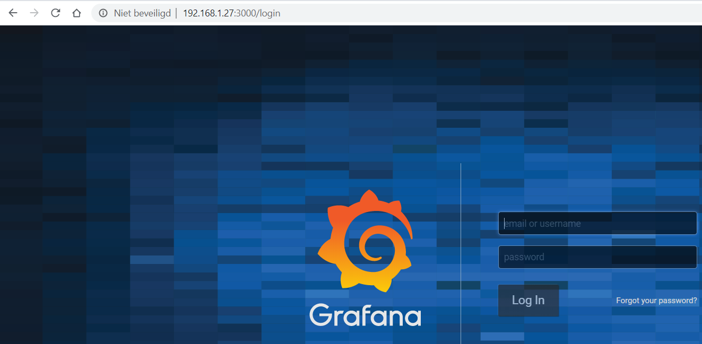
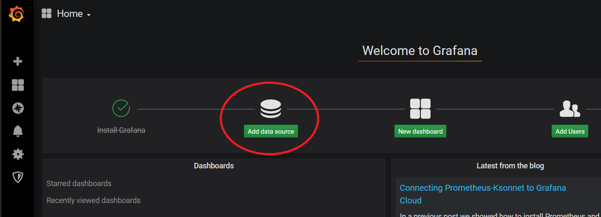
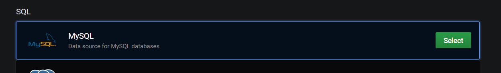
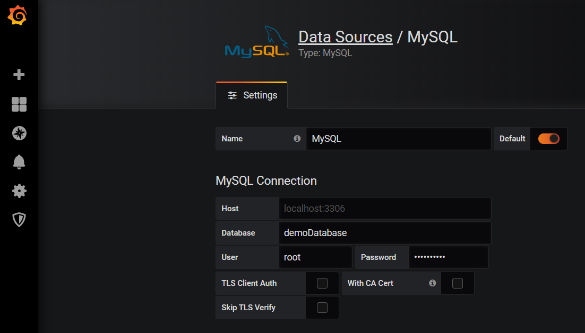
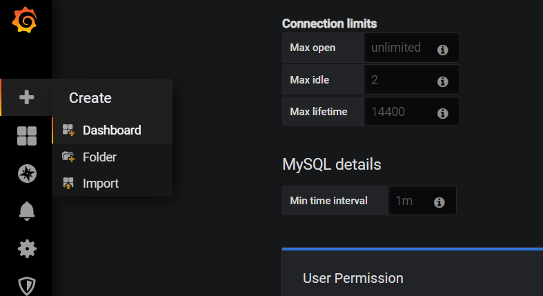
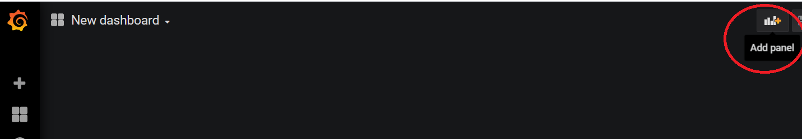
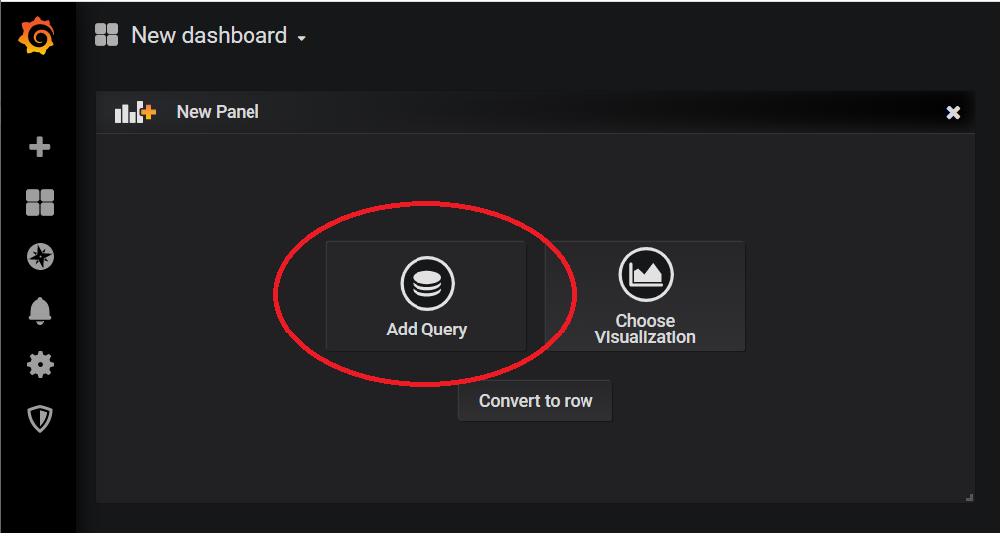
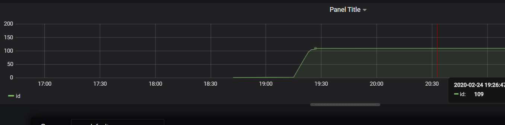

# Grafana

Grafana is een multi-platform open source visualisatie software. Als databron kan zowel gebruik gemaakt worden van time serie databases zoals Influx dB als relationele databases zoals MySQL. In volgende cursus wordt gebruik gemaakt van MySQL.

### Installatie

Grafana kan op verschillende besturingssystemen geïnstalleerd worden (Windows, MAC, Linux, ...) In deze cursus wordt Grafana geïnstalleerd op een raspberry pi 4 via volgende instructies in de LXTerminal.

```console
sudo apt-get install -y adduser libfontconfig1
wget https://dl.grafana.com/oss/release/grafana_6.6.2_armhf.deb
sudo dpkg -i grafana_6.6.2_armhf.deb
```
Kijk als er op volgende bronvermelding geen recentere versie aanwezig is: [https://grafana.com/grafana/download?platform=arm](https://grafana.com/grafana/download?platform=arm) 

Automatisch opstarten van grafana bij de opstart van de raspberry pi is mogelijk via:

```console
sudo systemctl enable grafana-server
```

Manueel opstarten van Grafana is mogelijk via:

```console
sudo systemctl start grafana-server
```

### Verbinding maken met MySQL

Wanneer je het IP-adres van de raspberry pi kent is het mogelijk grafana op te staten door het IP-adres in te geven in een browser gevolgd door poort 3000. Voorbeeld



De standaard gebruikersnaam is admin en het paswoord is eveneens admin. Pas uit veiligheidsoverwegingen het paswoord aan.

Om de MySQL database te verbinden met grafana moet een data source toegevoegd worden.



Kies voor MySQL



Maak volgende instellingen voor de data source.



Wanneer grafana en de database op server staan moeten enkel volgende instellingen gebeuren:
* Database
* Gebruiker database
* Paswoord database

Klik vervolgens op save & Test.

Wanneer de verbinding in orde is kan een dashboard toegevoegd worden door op + te klikken en vervolgens Dashboard te kiezen.



Voeg een Panel toe



Voeg een Query toe



De grafiek wordt weergegeven

