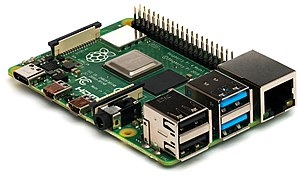

# Inleiding

De Raspberry PI is een kleine single bord computer.  De Raspberry Pi werd ontwikkeld aan de Universiteit van Cambridge en was bedoeld voor educatieve doeleinden. De productie van de eerste Raspberry Pi model B werd op 10 januari 2012 gestart. Sindsdien zijn er verschillende modellen en versies uitgebracht.


De aanwezigheid van de General Purpose Input/output pinnen maakt het mogelijk om zelf sensoren en acutator aan te sluiten op de raspberry pi. Eveneens zijn er heel wat addon-board beschikbaar.

# Verschillende modellen

Na de introductie in 2012 zijn er nog verschillende modellen ontwikkeld.

Raspberry pi Model A uit 2012 zonder netwerkaansluiting.


Raspberry pi B+ uit 2014 met o.a. micro SD-kaart in plaats van SD kaart.


Raspberry pi 3B uit 2018 met o.a. snellere 1,4 GHz processor, gigiabit ethernet aansluiting en dual band wifi.


Raspberry pi 4 uit 2019 met o.a. snellere 1,5 GHz processor, USB 3.0. De Raspberry pi 4 is eveneens te krijgen in versies met 1, 2 of 4 GB RAM-geheugen.




De recentste versies van de raspberry pi beschikken onder andere over:
* Voldoende USB poorten voor toetsenbord, muis en extra randapparaten.
* 40 pins connector voor General Purpose Input/output (GPIO)
* 1 GB LAN aansluiting
* WIFI
* Bluetooth
* ….

# Raspberry pi besturingssystemen

Er zijn verschillende besturingssystemen beschikbaar als image voor de raspberry pi.  Momenteel is het meest gebruikte Raspbian, wat in deze cursus gebruikt wordt.

Andere besturingssystemen zijn onder andere Ubuntu Mate, Windows 10 IOT core, Risc OS, …  

# Aanmaken bootable SD-kaart en opstarten Raspberry Pi

Er moet een bootable mico SD-kaart aangemaakt worden waar het besturingssysteem op staat. 
De laatste versie van Raspbian kan gedownload worden van de Raspberry PI website [download Raspbian](https://www.raspberrypi.org/downloads/)

Op de website heb je de keuze tussen NOOBS en Raspbian.

NOOBS staat voor New Out Of the Box Software. Dit is een “Opertating System installer” die o.a. Raspbian bevat.
 
Er zijn verschillende versie van Raspbian beschikbaar:
* Met toegevoegde educatieve software;
* Standaard versie met desktinterface;
* Lite versie zonder desktopinterface;

Er is minimaal een SD-kaart van 4 GB nodig. Met het programma etcher.io kan de image op de SD-kaart geplaatst worden.
[etcher](https://www.balena.io/etcher/)

Selecteer zeker de correcte driverletter en selecteer de gedownloade image.  Druk vervolgens op de flash knop en ga een koffie drinken.


Wanneer alle info op de SD-kaart staat kan deze in de raspberry pi geplaatst worden.

# Opstarten

Na het aansluiten van een toetsenbord, muis, voeding en een scherm via HDMI of micro HDMI aansluiting (Rapsberry Pi 4) krijg je een grafische omgeving of een terminial omgeving afhankelijk van de gekozen versie van Raspbian.


Vervolgens moet het land, de taal en de tijdszone ingesteld worden.

De standaard gebruiker is pi en het paswoord raspberry. Het is echter aan te raden dit paswoord aan te passen.

Eveneens kan er een verbinding gemaakt worden met het wifi netwerk.

Als laatste stap wordt gevraagd om de software te updaten. Dit zal even duren. Neem gerust terug een kop koffie.

# Raspberry pi vanop afstand bedienen

Om de raspberry pi vanop afstand via de grafische interface te bedienen kan gebruikt gemaakt worden van VNC. VNC moet gedownload worden op de computer die gebruikt wordt voor de externe toegang. [VNC Viewer](https://www.realvnc.com/en/connect/download/viewer/)

Op de raspberry pi moet de toegang via VNC ingesteld worden. 


Schakel vervolgens VNC in.


Start de Raspberry Pi opnieuw op en zoek het IP-adres op via LXTernminal.


Type de instructie ifconfig in de LXTerminal


Het IP-adres wordt weergegeven. Noteer of onthoud het IP-adres van de raspberry pi.

Geef het IP-adres in VNC-Viewer.


De Raspberry Pi kan nu vanop afstand bediend worden.

Indien er als melding komt "Cannot currently show the desktop" moet op de LXTerminal ingelogd worden.
Met volgende instructie kan de configuratie aangepast worden.

```console
sudo raspi-config
```

Kies vervolgens Advanced Options - A5 Resolution en kies een resolutie.

# Opdrachten

Zoek volgende informatie op het internet op:
* Hoeveel RAM-geheugen is aanwezig op de recentste Raspberry PI borden.
* Welke poort wordt gebruikt tot en met versie 3 van de raspberry pi om het beeld zichtbaar te maken.
* Welke poort wordt gebruikt vanaf versie 4 van de raspberry pi om het beeld zichtbaar te maken. 
* Welke versie van Bluetooth is aanwezig op de recentste versie van de raspberry pi.
* Welke versie van Wifi is aanwezig op de recentste versie van de raspberry pi.


