# LAMP-server

Standaard wordt Raspbian (een Linux distributie aangepast voor de Raspberry Pi) gebruikt als besturingssysteem op de Rapsberry Pi. Mits het toevoegen van de nodige programma's is het mogelijk de raspberry pi te gebruiken als webserver en database. In deze cursus gebruiken we de LAMP-stack hiervoor. De LAMP-stack is open source software en staat voor:
* Linux: het besturingssysteem
* Apache: een HTTP-webserver
* MySQL: een database
* PHP: een programmeertaal voor dynamische webpagina’s.


# Lamp-componenten installeren en gebruiken

## Raspbian bijwerken

Voor het installeren wordt Raspbian best bijgewerkt naar de nieuwste versie. Dit is mogelijk met volgende opdrachten in de LXTerminal:

```console
sudo apt update
sudo apt upgrade
```

## Apache HTTP-server

Het internet is een groot netwerk van computers. Niet alle computers hebben dezelfde taak. Servers zijn normaal altijd beschikbaar en bieden diensten aan. Clients zijn meestal niet altijd beschikbaar en vragen informatie op aan servers. Dit model wordt het client/server model genoemd.

### HTTP-protocol

Het HTTP-protocol (Hyper Tekst Transfer Protocol) is gemaakt voor Client-server toepassingen. Het HTTP-protocol is gestandaardiseerd door de IETF (Internet Engineering Task Force) Standaard maakt HTTP gebruik van poort 80. Andere poorten zijn echter ook mogelijk.

### Installatie

Apache kan geïnstalleerd worden met de apt-pakketmanager. Voer volgende opdracht uit in de LXTerminal:

```console
sudo apt install apache2
```

### Oefeningen

Als alles goed is gegaan, functioneert de Raspberry Pi al een HTTP-server met behulp van Apache. De eenvoudigste manier om dit te testen is op de raspberry pi zelf. Open de browser en surf naar localhost. U moet de Apache Debian standaardpagina krijgen.

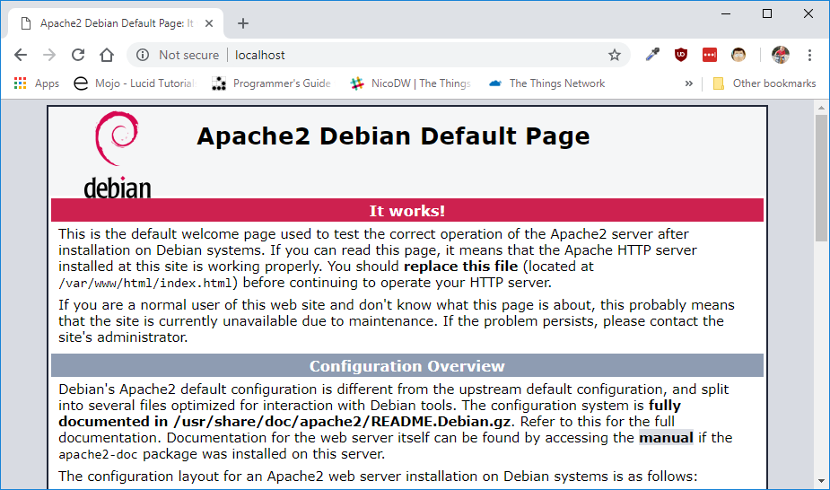

Het is ook mogelijk om vanaf een andere machine toegang te krijgen tot de webpagina. De enige vereiste is dat de client zicht in hetzelfde netwerk bevindt. Hiervoor heb je het IP-adres van de Raspberry PI nodig. Dit is mogelijk via volgende opdracht in de LXTerminal:

```console
ifconfig
```
Ga naar de standaarpagina op de Apache server vanop een andere computer in het netwerk.

## Aanpassen rechten Apache server

Om het mogelijk te maken om html bestanden op de Apache server te plaatsen moeten de rechten aangepast worden van de map /var/www/html.

Dit is mogelijk via:

```console
sudo chown -R pi:www-data /var/www/html/
sudo chmod -R 770 /var/www/html/
```

## Eenvoudige webpagina op Apache server

Maak een eenvoudige webpagina demo1.html en plaats deze in de map /var/www/html

Hiervoor installeren we eerst leafpad.

```console
sudo apt install leafpad
```
start leafpad op via de LXTerminal. Het is nodig leafpad als super user op te starten anders is het niet mogelijk een bestand te bewaren in de map /var/www/html.

```console
sudo leafpad
```
Plaats onderstaande html pagina in het bestand demo1.html.

Voorbeeldpagina

```html
<!DOCTYPE html>
<html>
<head>
<title>Mijn eerste webpagina</title>
</head>
<body>

<h1>Mijn eerste webpagina</h1>
<p>Dit is een paragraaf.</p>

</body>
</html>
```

Een browser opent standaard het bestand index.html of index.php. Pas deze pagina op de raspberry pi aan.

Een alternatieve manier is de pagina demo1.html te schrijven in visual studio code en vervolgens via filezilla op de raspberry pi te plaatsen.

## MySQL-database

MySQL is een van de populairste databasebeheerssystemen ter wereld. MySQL kan worden gebruikt voor kleine ontwikkelingsprojecten tot grote sites. 

MySQL en MariaDB zijn open source en gratis te gebruiken. 


MySQL versus MariaDB

MySQL was oorsponkelijk volledig open source. Na de overname door Oracle is MySQL echter niet meer volledig open source, wat niet meer overeen komt met het oorspronkelijk idee van de ontwikkelaars. Daarom hebben de ontwikkelaars een fork gecreëerd waar de closed source onderdelen vervangen zijn door open-source. Deze fork wordt MariaDB genoemd en is volledig open source.
MariaDB en MySQL zijn compatibel.

### Wat is een database

Een database is een verzameling van gegevens die op een georganiseerde manier zijn opgeslagen. Je kunt een database beschouwen als een kast. 


### Tabellen

Wanneer informatie in een archiefkast wordt geplaatst, gooit u deze niet allemaal in dezelfde lade. U maakt lades voor specifieke informatie.

In een database worden tabellen gemaakt. Een tabel kan de gegevens van een klantenlijst bevatten. De informatie van een sensor, ….

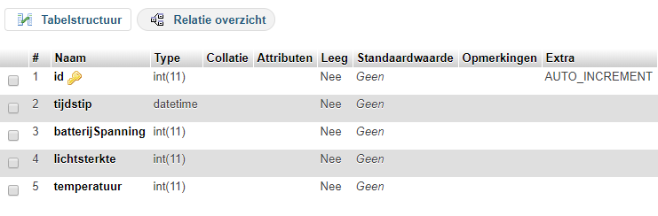

### kolommen en datatypes

Tabellen zijn opgebouwd uit kolommen. Kolommen bevatten een bepaald stuk informatie in de tabel. Voorbeeld de temperatuur gemeten door een sensor, het tijdstip, …

Een kolom in een database heeft een bijhorend gegevenstype. Het definieert welk type gegevens de kolom kan bevatten. Voorbeeld numeriek, datum, tekst, …

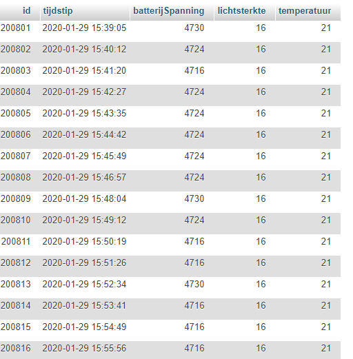

### Rijen

Gegevens in een tabel worden opgeslagen in rijen.

Voorbeeld: de temperatuur en lichtsterkte per meting.

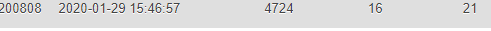

## Installatie MariadB
 
De MariadB (fork van MySQL) kan worden geïnstalleerd met de apt-pakketmanager met volgende opdracht:


```console
sudo apt install mariadb-server php-mysql -y
sudo service apache2 restart
```

## MySQL-client

U kunt de MySQL-client starten via de terminal.

```console
sudo mysql -u root
```

* mysql: starten mysql-client.
* -u root: de -u vertelt de client om in te loggen met de opgegeven naam, in dit geval 'root'.

Indien er al een paswoord is ingesteld krijg je een foutmelding. Start in dit geval de mysql client via volgende regel.

```console
sudo mysql -u root -p
```

Je zou nu verbonden moeten zijn en volgende tekst zien in de LXTerminal.

```console
MariaDB [(none)]>
```

## Uitproberen

Met SQL kunnen we veel dingen doen. De twee meest gebruikte soorten zijn:
* Gegevensdefinitie: dit bepaalt hoe gegevens worden opgeslagen. Welke tabellen de database bevat, hoe de tabellen zijn gestructureerd, welke eigenschappen en gegevenstypen hebben de kolommen.
* Gegevensmanipulatie: gegevens maken, lezen, bijwerken en verwijderen.

### Aanmaken database

Voordat we iets in SQL kunnen doen, moeten we een database maken. Dit kan worden gedaan met de CREATE DATABASE query. In onderstaand voorbeeld wordt de database bookstore aangemaakt.

```SQL
CREATE DATABASE bookstore;
```

### Verwijderen database

Wanneer je de database terug wil verwijderen is dit mogelijk met de DROP DATABASE query. In onderstaand voorbeeld wordt de database bookstore verwijderd.

```SQL
DROP DATABASE bookstore;
```

### Aanmaken tabel in database

Nu hebben we een database die tabellen en hun gegevens kan groeperen. Vervolgens maken we een nieuwe tabel aan in de database met de CREATE TABLE query. De tabel naam is books en wordt in onderstaande voorbeeld aangemaakt in de database bookstore. We moeten eveneens de verschillende kolommen definiëren die in de tabel zullen voorkomen. Elke kolom heeft een naam, datatype en extra eigenschappen.
Om een tabel te maken waarin gegevens over boeken, zoals ISBN, naam, beschrijving en prijs, kunnen worden opgeslagen, kunnen we de volgende query schrijven en uitvoeren.

```SQL
CREATE TABLE bookstore.books (
   id INT NOT NULL AUTO_INCREMENT,
   isbn CHAR(13) NOT NULL,
   name VARCHAR(64) NOT NULL,
   description TEXT,
   price DECIMAL(6,2),
   PRIMARY KEY(id)
);
```     

### Gegevensmanipulatie

Er zijn veel dingen die we met gegevens kunnen doen. De acties die kunnen worden toegepast, worden soms afgekort met CRUD. CRUD staat voor C reate, R ead, U pdate en D elete.

#### Invoer nieuwe gegevens

Gegevens invoeren in een tabel met SQL kan met de INSERT INTO query. Vervolgens voegen we de tabel toe waaraan we gegevens willen toevoegen en de waarden die in die kolommen moeten worden opgeslagen.

```SQL
INSERT INTO bookstore.books (isbn, name, description, price) VALUES ("9781449303969", "Learning MySQL", "Good book", 33.50);
```

#### Lezen

Nu we wat gegevens in de books tabel hebben, kunnen we deze ook uitlezen. Dit kan worden gedaan met behulp van de SELECT query. 

```SQL
SELECT isbn, name, description, price FROM bookstore.books;
```

Resultaat

```SQL
+---------------+----------------+-------------+-------+
| isbn          | name           | description | price |
+---------------+----------------+-------------+-------+
| 9781449303969 | Learning MySQL | Good book   | 33.50 |
+---------------+----------------+-------------+-------+
```

#### Aanpassen

Als we bestaande gegevens in een tabel willen wijzigen, kunt u de UPDATE query gebruiken. De UPDATE query geeft de kolomnaam en -waarde die u wilt wijzigen. In dit geval is het belangrijk om een WHERE clausule aan de query toe te voegen om de wijziging alleen toe te passen op het boek dat een specifiek isbn-nummer heeft. Als u het weglaat of vergeet WHERE, krijgen alle boeken de nieuwe prijs. Dit is meestal niet wat je zou willen.

```SQL
UPDATE bookstore.books SET price = 23.50 WHERE isbn = "9781449303969";
```

#### Verwijderen

De laatste manipulatie van gegevens is de DELETE. Met DELETE kunnen we gegevens uit de tabel verwijderen. Met DELETE wordt een volledige rij verwijderd in de tabel. Het is belangrijk om de WHERE clausule te gebruiken om te voorkomen dat alle rijen en dus alle gegevens in een tabel worden verwijderd.

```SQL
DELETE FROM bookstore.books WHERE isbn = "9781449303969";
```
## Opdracht SQL

Maak een database meetresultaten met een tabel sensor1.
Volgende kolommen moeten voorkomen in de tabel sensor1:
* id als int met auto_increment
* tijdstip als DATETIME
* temperatuur als float

De id is de primary key is id en er mag geen enkele kolom leeg blijven.

Maak een query om volgende data toe te voegen aan de tabel sensor1:
* tijdstip via NOW()
* temperatuur van 23.25 graden C.

Voeg vervolgens nogmaals de query uit met een temperatuur van 23.50 graden C.

Wat gebeurt er met de kolom id?

Voeg de tabel sensor2 met volgende kolommen toe:
* id als int met auto_increment
* tijdstip als DATETEIME
* temperatuur als float
*luchtvochtigheid als float

Maak een query om volgende data toe te voegen aan de tabel sensor2:
* tijdstip via NOW()
* temperatuur van 23.25 graden C.
* luchtvochtigheid van 50 %.

## PhpMyAdmin

PhpMyAdmin is een gratis en open source beheertools voor MySQL en MariaDB. PhpMyAdmin is een web applicatie die geschreven is in PHP. Met PHPMyAdmin kunnen databases op een grafische manier beheerd worden.

### Installatie

PhpMyAdmin kan geinstalleerd worden via de apt-pakketmanager.

```console
sudo apt install phpmyadmin -y
```

PhpMyAdmin moet toegevoegd worden in de apache configuratie.

```console
sudo nano /etc/apache2/apache2.conf
```

Voeg in het bestand apache2.conf volgende regel toe

```console
include /etc/phpmyadmin/apache.conf
```

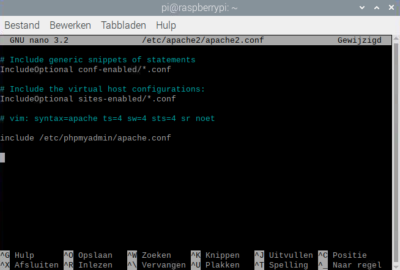

Herstart de apache server

```console
sudo service apache2 restart
```

Vanaf nu is het mogelijk om te surfen naar *[http://localhost/phpmyadmin](http://localhost/phpmyadmin) 

In oude versies van PhpMyAdmin was het nog mogelijk om het paswoord van de standaardgebruikersnaam root niet in te vullen. Wegens veiligheidsredenen is dit niet meer wenselijk en mogelijk.

Een paswoord toekennen aan de root gebruiker:

```console
sudo mysql -u root
```
Vul in plaats van NEWPASSWORD een gekozen paswoord in.

```SQL
UPDATE mysql.user SET plugin = 'mysql_native_password', 
  Password = PASSWORD('NEWPASSWORD') WHERE User = 'root';
FLUSH PRIVILEGES;
```

Nu moet het mogelijk zijn in de loggen op phpMyAdmin met de gebruiker root en het gekozen paswoord.

## Aanmaken database en tabel met PhpMyAdmin

Kies "Nieuw" en geef de database een naam. Voorbeeld "demoDatabase". Klik vervolgens op Aanmaken.

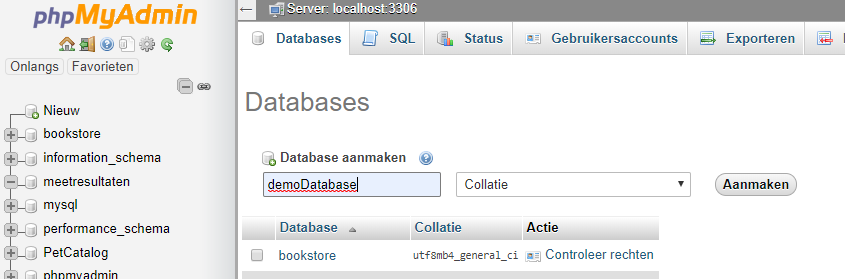

Maak een tabel meetresultaten aan met 4 kolommen.

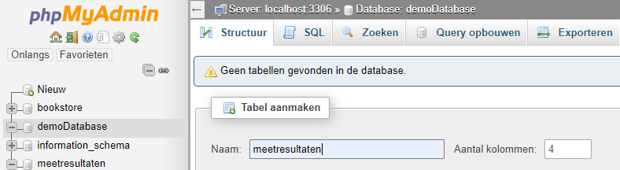

Voeg volgende kolommen toe aan de tabel meetresultaten:
* id als int met auto_increment
* tijdstip als DATETEIME
* waarde1 als float
* waarde2 als float

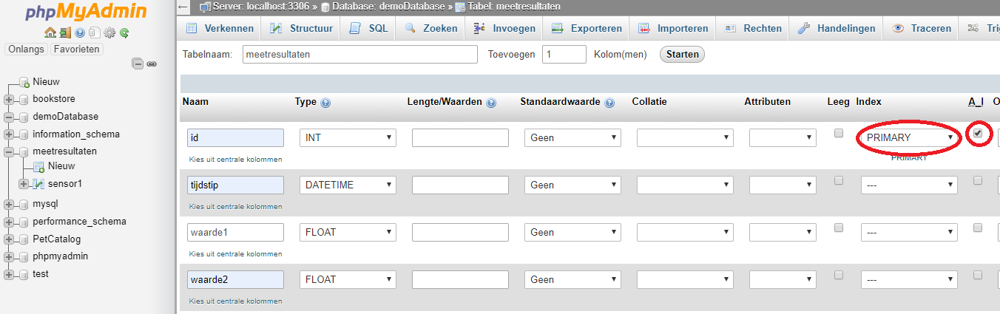

## Opdracht aanmaken database en tabel met PhpMyAdmin

Maak een database meetresultaten1 met een tabel sensor1.
Volgende kolommen moeten voorkomen in de tabel sensor1:
* id als int met auto_increment
* tijdstip als DATETIME
* temperatuur als float

De id is de primary key is id en er mag geen enkele kolom leeg blijven.

## Query's uitvoeren in PhpMyAdmin

Query's kunnen eveneens geschreven worden in PhpMyAdmin. Je informatie uit een tabel wil weergeven of informatie in een tabel wil toevoegen selecteer je de tabel en kies je vervolgens voor SQL.

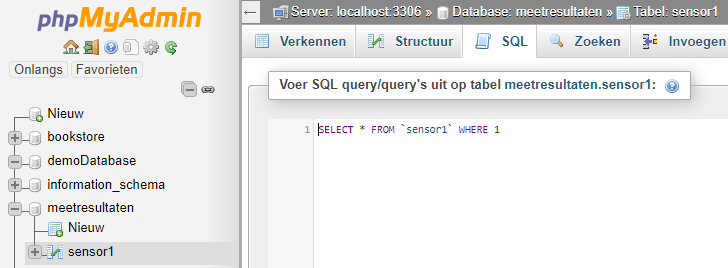

Het invoeren van een temperatuur in de tabel sensor1 wordt:

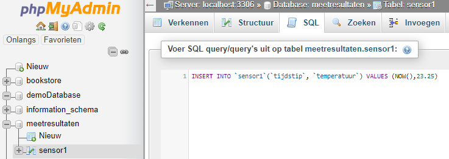

Het weergeven van alle waardes waarbij de temperatuur groter is dan 23 °C wordt

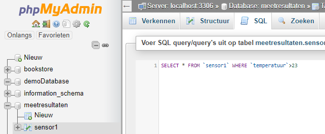

Het is eveneens mogelijk maar een aantal kolommen weer te geven. In volgende voorbeeld worden enkel het tijdstip en de temperatuur weergeven.

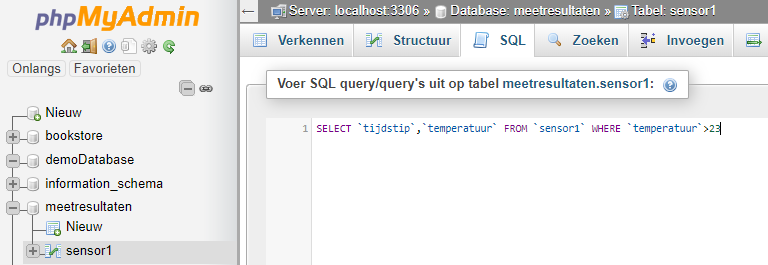

## Opdrachten Query's uitvoeren in PhpMyAdmin

Maak een query om volgende data toe te voegen aan de tabel sensor1:
* tijdstip via NOW()
* temperatuur van 22.25 graden C.

Voeg vervolgens nogmaals de query uit met een temperatuur van 22.50 graden C.

Voeg de tabel sensor2 met volgende kolommen toe aan de database meetresultaten:
* id als int met auto_increment
* tijdstip als DATETEIME
* temperatuur als float
*luchtvochtigheid als float

Maak een query om volgende data toe te voegen aan de tabel sensor2:
* tijdstip via NOW()
* temperatuur van 23.25 graden C.
* luchtvochtigheid van 50 %.

Geef alle waardes uit de tabel sensor2 weer waarbij de temperatuur groter is dan 22°C.

## PHP

PHP is een populaire server scripting taal voor het maken van dynamische webpagina's.

PHP is gratis en open source.

De extensie van de php bestanden is .php. Visual studio code is ideaal geschrikt voor het schrijven van php scripts.

In de cursus plaatsen we de php bestanden op de apache2 webserver in de map var\www\html.

PHP-scripts kunnen gebruikt worden tussen html code. De scripts staten steeds met <?php en eindigen met ?>.

Een voorbeeld van PHP en HTML:

```PHP
<!DOCTYPE html>
<html>
  <body>
    <h1>My first PHP page</h1>
    <?php
      echo "Hello World!";  //met echo wordt de tekst "Hello world" weergegeven in de browser.
    ?>
  </body>
</html>
```

PHP-variabelen beginnen steeds met het $ teken. 

## PHP en MySQL

Met Php is het mogelijk info afkomstig van een browser of microcontroller via een GET request in een database te plaatsen.

Als voorbeeld worden 2 waardes in de tabel "demoTabel" bewaard in de database demoDatabase.

Maak deze tabel en database aan indien ze nog niet bestaan.

Voorbeeldcode: 

```PHP
<?php
$servername = "localhost"; //indien het php bestand en de database beide op dezelfde computer staan.
$username = "root";
$password = "password";  //Gebruik het opgegeven paswoord  
$dbname = "demoDatabase";     //database naam

//Parameter 1 via GET in variabele waarde plaatsen
if(isset($_GET["waarde1"])){
    $varWaarde1 = $_GET["waarde1"];
} 
else { 			//indien geen parameters opgegeven
    echo "ERROR no key defined in URL!";
    die();
}
echo $varWaarde1;

//Parameter 2 via GET in variabele waarde plaatsen

if(isset($_GET["waarde2"])){
    $varWaarde2 = $_GET["waarde2"];
} 
else { 			//indien geen parameters opgegeven
    echo "ERROR no key defined in URL!";
    die();
}
echo $varWaarde2;

// Create connection
$conn = new mysqli($servername, $username, $password, $dbname);
// Check connection
if ($conn->connect_error) {
    die("Connection failed: " . $conn->connect_error);
} 
echo "Connection successfully";

//Opstellen query om het tijdstip + de waardes in de database te bewaren.
$sql = "INSERT INTO demoTabel (tijdstip,waarde1,waarde2) VALUES (NOW(),$varWaarde1,$varWaarde2)";

//querry uitvoeren
if ($conn->query($sql) === TRUE) {
    echo "New record created successfully";
} else {
    echo "Error: " . $sql . "<br>" . $conn->error;
}
$conn->close();
?>
```
Bewaar het bestand als dataToMySQL.php en plaats het php bestand via filezilla in de map var/www/html.

Test de werking van het php bestand door 2 waardes via een GET request mee te geven in de browser.

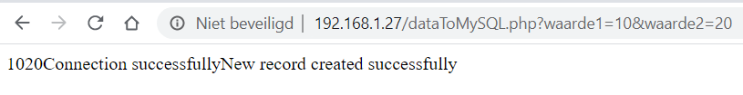

